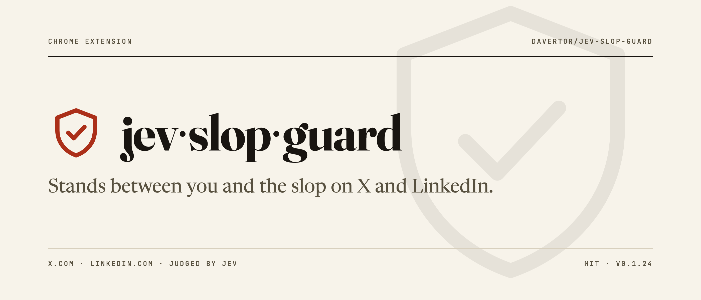
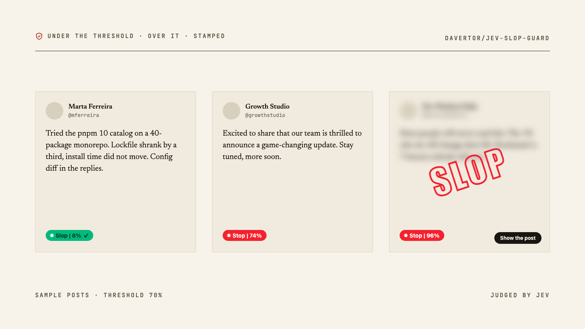
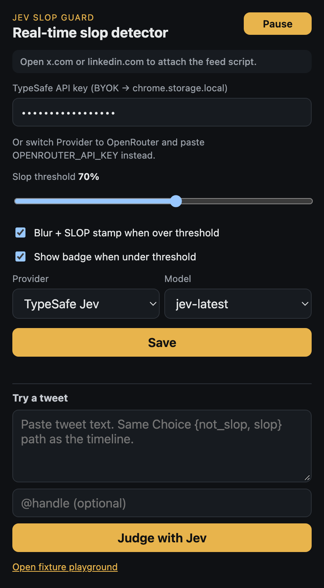

  <picture>
    <source media="(prefers-color-scheme: dark)" srcset="docs/hero-dark.png">
    
  </picture>

  
  
  
  

**A Chrome extension that stands between you and the slop on X and LinkedIn.**

Every post gets a small pill with a slop probability. Posts over your threshold
get blurred and stamped **SLOP**, with a button to show them anyway. The verdict
comes from [Jev](https://typesafe.ai), TypeSafe's System One model: one typed
`{ slop, not_slop }` choice per post, no free-form LLM text, and you bring your
own API key.

  <picture>
    <source media="(prefers-color-scheme: dark)" srcset="docs/badges-dark.png">
    
  </picture>

  <a href="#what-it-does">What it does</a> ·
  <a href="#requirements">Requirements</a> ·
  <a href="#try-it-in-your-chrome">Try it in your Chrome</a> ·
  <a href="#settings">Settings</a> ·
  <a href="#privacy">Privacy</a> ·
  <a href="#references">References</a>

---

## What it does

Works on **[x.com](https://x.com)** and **[linkedin.com](https://www.linkedin.com/feed/)**.

- Every post gets a pill with its slop score: green **Slop** below your
  threshold, red **Stop** at or above it.
- At or above the threshold the post is also blurred and stamped **SLOP**.
  **Show the post** clears that for the current session.
- Scrolling is never blocked. Classification runs in the background with a
  small concurrency limit and a per-post cache, so a post is scored once.
- Promoted and sponsored posts and "Who to follow" widgets are skipped.

## Requirements

- **Chrome**, or any browser that loads Manifest V3 extensions.
- **An API key** for one of the two providers. Every post is classified by
  Jev on that account, so usage is billed to you.
  - [TypeSafe AI](https://console.typesafe.ai), the default provider.
  - [OpenRouter](https://openrouter.ai/keys). Allow TypeSafe under
    OpenRouter Settings → Privacy, or the decisions endpoint refuses the call.

## Try it in your Chrome

1. Clone or download this repo. The built extension is in [`chrome-mv3/`](chrome-mv3/).
2. Open `chrome://extensions`.
3. Turn on **Developer mode** (top-right toggle).
4. Click **Load unpacked** and pick the `chrome-mv3/` folder.
5. Pin **Jev Slop Guard** in the toolbar, open the popup, paste your API key, click **Save**.
6. Open [x.com](https://x.com) or [linkedin.com/feed](https://www.linkedin.com/feed/)
   and scroll.

## Settings

  

Stored in `chrome.storage.local` only. Nothing leaves your browser except the
classification request described below.

| Control | Default | Effect |
| --- | --- | --- |
| Pause / Start | running | Pause stops new classifications. Existing badges stay. |
| API key | empty | Your TypeSafe or OpenRouter key |
| Provider | TypeSafe | Switch to OpenRouter to use an OpenRouter key instead |
| Model | `jev-latest` | `jev-1.13.0` pins a version |
| Slop threshold | 70% | Slop probability at or above this gets **Stop**, blur and stamp |
| Blur + SLOP stamp | on | Off keeps the pills but never covers a post |
| Show badge when under threshold | on | Off hides the green pill and marks only **Stop** |

## Privacy

For each post the extension sends the post text and the author handle to the
provider you picked, and nothing else. Your key and settings stay in
`chrome.storage.local`. The extension asks for access to `x.com`
and `linkedin.com` to read posts and draw badges, and to
`api.typesafe.ai` and `openrouter.ai` to send the classification requests.

## References

- [Robin Bilgil's real-time slop detector demo](https://x.com/RBilgil/status/2100976648552169805),
  the idea this extension copies: a pill under the post, then blur and a **SLOP** stamp.

## License

[MIT](LICENSE)
